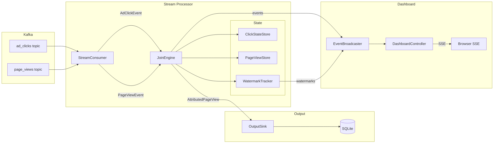

# Real-time Session Attribution with Windowed Stream Joins

In online marketplaces, advertisers need to understand which campaigns drive product page views to optimize budget allocation, analyze conversion funnels, and ensure billing accuracy, making real-time reporting and campaign performance measurement essential.

This repository implements a **stream processor** that consumes two event streams, `ad_clicks` and `page_views`, and produces an output stream, `attributed_page_view`, representing the most recent ad click by the same user within 30 minutes of each page view, with support for out-of-order events up to 15 minutes late.

## Architecture



## Setup

### Requirements

- Docker
- Docker Compose

### Usage

```shell
# Build docker image
docker-compose build

# Start services (detached)
docker-compose up -d

# Run processor
docker-compose exec dev mvn spring-boot:run 

# Open the dashboard in your browser (optional)
#    http://localhost:8080

# Add data to kafka topics
docker-compose exec dev python data_generator.py

# Check results in Sqlite database
docker-compose exec dev sqlite3 output/attributed_page_views.db "SELECT * FROM attributed_page_views ORDER BY 1"
```
### Results

| page_view_id | user_id | event_time           | url                                                          | campaign   | click_id |
| ------------ | ------- | -------------------- | ------------------------------------------------------------ | ---------- | -------- |
| pv_1         | user_1  | 2024-01-01T12:10:00Z | [https://example.com/product1](https://example.com/product1) | campaign_A | click_1  |
| pv_2         | user_2  | 2024-01-01T12:15:00Z | [https://example.com/product2](https://example.com/product2) | campaign_B | click_2  |
| pv_3         | user_3  | 2024-01-01T12:30:00Z | [https://example.com/product3](https://example.com/product3) | campaign_D | click_3b |
| pv_4         | user_4  | 2024-01-01T13:10:00Z | [https://example.com/product4](https://example.com/product4) |            |          |
| pv_5         | user_5  | 2024-01-01T12:45:00Z | [https://example.com/product5](https://example.com/product5) |            |          |
| pv_6         | user_6  | 2024-01-01T13:20:00Z | [https://example.com/product6](https://example.com/product6) |            |          |

### Dashboard

A real-time web dashboard is served at [http://localhost:8080](http://localhost:8080) when the processor is running.

Features:
- **Live Feed** — scrolling event stream showing clicks, page views, attributions, and dropped events as they are processed
- **Timeline** — per-user visualization of clicks and page views on a time axis, with attribution links and watermark positions
- Both views support filtering by user

The dashboard receives events via Server-Sent Events (SSE) and stores them in the **browser's localStorage**.  
This means you must open the dashboard **before** producing events, otherwise they won't be captured.

Use the **Clear** button to reset all stored events and counters.

### Unit tests

```shell
# Run all unit tests
docker-compose exec dev mvn test -pl .
```

## Implementation Design

### Watermark logic

Because `ad_clicks` and `page_views` are consumed by separate threads, a click can arrive after its corresponding page view. 
Watermarks allows the processor to handle out-of-order delivery.

The watermark will keep track of the latest received event time for each topic and partition, and it will only advance monotonically (never backwards).  
This way if a click or page event comes late we can safely drop that event in case it arrives later than the accepted window (15 min).  
Watermark storage key format: `"topic:partition"`

### Write semantics

Opted for `Update` semantics to prevent high latency. When a page view arrives, it is immediately emitted with the best known click at that moment or with null attribution if no matching click exists yet.

Page views are buffered so that late-arriving clicks can trigger re-attribution. If a better click is found, a corrected record is written, overwriting the previous one.

Data is stored in a SQLite database table and new records are merged based on page_view_id.

### Delivery guarantees

Delivery is done `at-least-once` where the offsets are committed only after the sink successfully writes the record to the database.
On crash/restart offsets that are still pending would end up being re-processed, as mentioned in [Write semantic](#write-semantics), records are overwritten in the database table guaranteeing an idempotent output.

### Concurrency model

Each partition is consumed by a single thread, and can be configured by `kafka.consumer.concurrency` application config.

Both clicks and page views are stored with ConcurrentHashMaps for thread safety, where the key is the userId and events are stored in ascending order based on the event time.  
In a rare case where two events have the exact same event time the Kafka offset is used as a tie-breaker.

Locks are managed on per-user TreeSets, in other words, different users can be processed in parallel without issues.

Watermarks are also stored using ConcurrentHashMap using atomic `merge` updates. 

The output sink is using Sqlite for simplicity and local tests, WAL logs are enabled to allow concurrent reads/writes.   
Writes can eventually become a bottleneck in production environments, this could be solved by using a database that supports concurrent writes with row-level locking.
Another alternative is to batch the writes, but this would  


### Capacity / Scaling

By controlling the amount of Kafka partitions and increasing the processor concurrency we can horizontally scale the system.

The state size defines the memory requirement and is controlled by the eviction strategy: `watermark - attribution windows - allowed lateness` (applied for both `clicks` and `pages views`)

To properly evaluate the state size we should measure the max concurrent active users and what is the average clicks and page views per user.

Scaling to multiple processor instances requires co-partitioned joins. Both topics must have the same number of partitions and be keyed by `userId`. A single Kafka consumer (subscribed to both topics) with the `RangeAssignor` guarantees that the same partition numbers from both topics are assigned to the same consumer instance.
