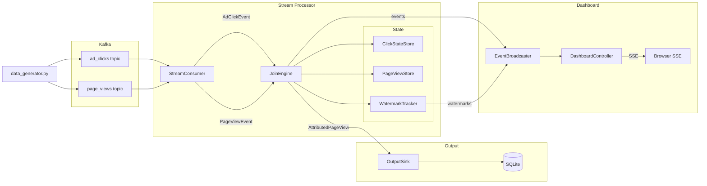

# Real-time Session Attribution with Windowed Stream Joins

In online marketplaces, advertisers need to understand which campaigns drive product page views to optimize budget allocation, analyze conversion funnels, and ensure billing accuracy, making real-time reporting and campaign performance measurement essential.

This repository implements a **stream processor** that consumes two event streams, `ad_clicks` and `page_views`, and produces an output stream, `attributed_page_view`, representing the most recent ad click by the same user within 30 minutes of each page view, with support for out-of-order events up to 15 minutes late.

To test the system a python script generates events that cover the following scenarios:
- Normal - click before page view
- Click arrives AFTER page view (out of order, within lateness)
- Multiple clicks in window (should pick latest)
- Click outside 30-minute window (should NOT be attributed)
- Very late click (beyond allowed lateness - should be dropped)
- No click page view without attribution

## Architecture



## Setup

### Requirements

- Docker
- Docker Compose

### Usage

```shell
# Build docker image
docker-compose build

# Start services (detached)
docker-compose up -d

# Run processor
docker-compose exec dev mvn spring-boot:run 

# Open the dashboard in your browser (optional)
#    http://localhost:8080

# Add data to kafka topics
docker-compose exec dev python data_generator.py

# Check results in Sqlite database
docker-compose exec dev sqlite3 output/attributed_page_views.db "SELECT * FROM attributed_page_views ORDER BY 1"
```

### Results


| page_view_id | user_id | event_time           | url                          | campaign   | click_id | scenario                                     |
| ------------ | ------- | -------------------- | ---------------------------- | ---------- | -------- | -------------------------------------------- |
| pv_1         | user_1  | 2024-01-01T12:10:00Z | https://example.com/product1 | campaign_A | click_1  | Normal — click before page view              |
| pv_2         | user_2  | 2024-01-01T12:15:00Z | https://example.com/product2 | campaign_B | click_2  | Out-of-order — click arrives after page view  |
| pv_3         | user_3  | 2024-01-01T12:30:00Z | https://example.com/product3 | campaign_D | click_3b | Multiple clicks — picks the latest in window |
| pv_4         | user_4  | 2024-01-01T13:10:00Z | https://example.com/product4 |            |          | Click outside 30-min window — no attribution |
| pv_5         | user_5  | 2024-01-01T12:45:00Z | https://example.com/product5 |            |          | Late click dropped — beyond allowed lateness |
| pv_6         | user_6  | 2024-01-01T13:20:00Z | https://example.com/product6 |            |          | No click — page view without any click       |

### Dashboard (Bonus)

A real-time web dashboard is served at [http://localhost:8080](http://localhost:8080) when the processor is running. Built with vanilla HTML/JS and Server-Sent Events.

Features:
- **Live Feed** — scrolling event stream showing clicks, page views, attributions, and dropped events as they are processed
- **Timeline** — per-user visualization of clicks and page views on a time axis, with attribution links and watermark positions
- Both views support filtering by user

The dashboard receives events via Server-Sent Events (SSE) and stores them in the **browser's localStorage**.  
This means you must open the dashboard **before** producing events, otherwise they won't be captured.

Use the **Clear** button to reset all stored events and counters.

### Unit tests

```shell
# Run all unit tests
docker-compose exec dev mvn test -pl .
```

Test coverage:
- **JoinEngineTest**: click before page view, click after page view (out-of-order), multiple clicks in window, click outside attribution window, late event dropping, page view without any click
- **RestartTest**: process half the events, simulate crash (lose all in-memory state), rebuild engine and replay from committed offsets, verify final output matches a no-crash run
- **ConcurrencyTest**: concurrent partition processing, concurrent clicks and page views for the same user (repeated 3x to catch race conditions)
- **WatermarkTrackerTest**: watermark advances, does not go backward, tracks partitions independently

## Implementation Design

### Watermark logic

Because `ad_clicks` and `page_views` are consumed by separate threads, a click can arrive after its corresponding page view. 
Watermarks allow the processor to handle out-of-order delivery.

The watermark will keep track of the latest received event time for each topic and partition, and it will only advance monotonically (never backwards).  
This way if a click or page event comes late we can safely drop that event in case it arrives later than the accepted window (15 min).  
Watermark storage key format: `"topic:partition"`

A scheduled eviction task runs every 30 seconds, removing clicks and page views older than `min_watermark - attribution_window - allowed_lateness` to prevent unbounded memory growth.

### Write semantics

Opted for `Update` semantics to prevent high latency. When a page view arrives, it is immediately emitted with the best known click at that moment or with null attribution if no matching click exists yet.

Page views are buffered so that late-arriving clicks can trigger re-attribution. If a better click is found, a corrected record is written, overwriting the previous one.

Data is stored in a SQLite database table and new records are merged based on page_view_id.

### Delivery guarantees

Delivery is done `at-least-once` where the offsets are committed only after the sink successfully writes the record to the database.
On crash/restart, offsets that are still pending would end up being re-processed. As mentioned in [Write semantics](#write-semantics), records are upserted by `page_view_id` in the database, guaranteeing idempotent output.

Failure scenarios:
- **Processor crash** — uncommitted offsets are replayed on restart. Upsert semantics ensure no duplicate output.
- **Sink unavailable** — the write fails, the offset is not committed, and the event will be retried on the next poll.
- **Kafka broker down** — the consumer will keep retrying connections using Spring Kafka's built-in retry mechanism until the broker is available again.

### Concurrency model

Each partition is consumed by a single thread, and can be configured by `kafka.consumer.concurrency` application config.

Both clicks and page views are stored with ConcurrentHashMaps for thread safety, where the key is the userId and events are stored in ascending order based on the event time.  
In a rare case where two events have the exact same event time the Kafka offset is used as a tie-breaker.

Locks are managed on per-user TreeSets, in other words, different users can be processed in parallel without issues.

Watermarks are also stored using ConcurrentHashMap with atomic `merge` updates to prevent concurrent partition threads from accidentally moving a watermark backward.

The output sink uses SQLite for simplicity and local tests, with WAL mode enabled to allow concurrent reads/writes.
In production, writes could become a bottleneck, this could be solved by using a database with row-level locking or by batching writes at the cost of slightly higher latency.

Duplicate clicks are handled naturally: the `TreeSet` stores clicks sorted by event time (with offset as tie-breaker), and `findAttributableClick` always picks the latest click in the window. Since the output sink upserts by `page_view_id`, duplicate attributions produce the same row.

### Capacity / Scaling

By controlling the amount of Kafka partitions and increasing the processor concurrency we can horizontally scale the system.

The state size defines the memory requirement and is controlled by the eviction strategy: `watermark - attribution windows - allowed lateness` (applied for both `clicks` and `pages views`)

To properly evaluate the state size we should measure the max concurrent active users and what is the average clicks and page views per user.

Scaling to multiple processor instances requires co-partitioned joins. Both topics must have the same number of partitions and be keyed by `userId`. A single Kafka consumer (subscribed to both topics) with the `RangeAssignor` guarantees that the same partition numbers from both topics are assigned to the same consumer instance.

### State recovery

All join state is held in memory. In the event of a crash or restart, this state is lost. Without recovery, a page view arriving after restart may miss a click that was in memory before the crash (Kafka offset was already committed, making it impossible to replay from source).

To solve this, every click and page view processed by the engine is written to a Kafka changelog topic, keyed by user ID and partitioned to match the source partition. On startup, both changelog topics are read from beginning to end, rebuilding the state stores directly, with main consumers starting only after replay completes.

Changelog topic retention must cover at least the state window (`attribution_window + allowed_lateness`) and compaction should be disabled.

### Known Limitations

#### Unbounded in-memory state under burst traffic

If a burst of events arrives with event times within the 45-minute retention window, all are kept in memory regardless of volume. Since eviction depends on watermark advancement (new events), pausing the consumer to relieve memory pressure would freeze eviction, creating a deadlock.

One solution would be to solve this with disk-backed state stores (RocksDB), decoupling state size from heap capacity but increasing slightly the latency.

#### Cross-stream lag may cause missed attributions

If one stream stops producing events (e.g. the click stream goes silent while page views keep flowing), page views will be emitted with null attribution even though matching clicks may arrive later. This happens because the system has no way to know whether the other stream is lagging or simply has no events to send.

A possible solution is a min watermark gate: hold page view emissions until both streams have advanced their watermarks past the page view's event time, with a safety-valve idle timeout to avoid blocking indefinitely if one stream is genuinely inactive.

